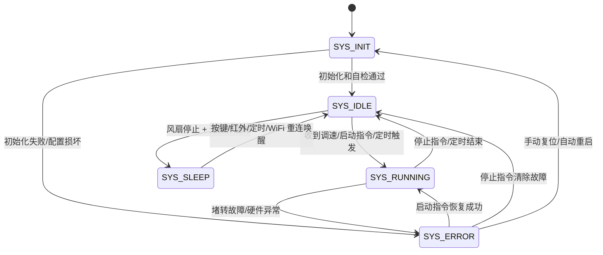
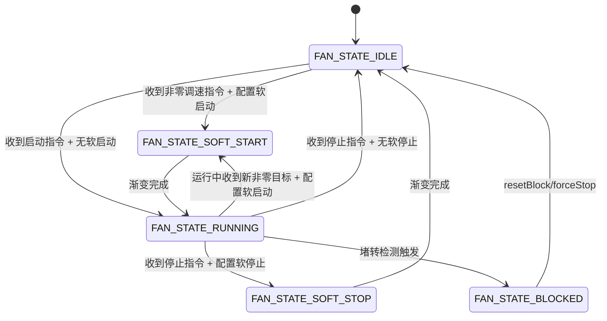

# DOC-03 软件架构设计

| 字段 | 内容 |
|------|------|
| 文档编号 | DOC-03 |
| 项目名称 | 壁炉烟囱正压送风控制器 |
| 版本 | v1.3 |
| 日期 | 2026-05-11 |
| 状态 | 已确认 |

---

## 1. 架构概览

```
┌────────────────────────────────────────────────────┐
│           应用层（main.cpp）                        │
│  引脚配置 + 模块实例化 + 路由注册 + 事件桥接         │
├────────────────────────────────────────────────────┤
│         业务逻辑层（src/fan/）                      │
│  FanController：核心状态机、档位管理、指令调度、定时逻辑 │
├────────────────────────────────────────────────────┤
│       硬件抽象层（src/fan/）                        │
│  FanDriver、ButtonDriver、LedIndicator、IRReceiverDriver │
├────────────────────────────────────────────────────┤
│       基础设施层（Esp8266Base 库）                  │
│  Log、Config、WiFi、Web、OTA、NTP、mDNS、Sleep、WDT │
└────────────────────────────────────────────────────┘
```

**层间规则**：
- 上层调用下层，下层不得 `#include` 上层头文件
- 风扇业务模块（fan/）依赖 Esp8266Base，Esp8266Base 不依赖风扇模块
- Web 层（FanWeb）持有 FanController 引用，属应用级，不可放入 HAL 层

---

## 2. 核心术语定义

| 术语 | 定义 |
|------|------|
| 档位 | 风扇运行档位，0-4 档，分别对应 0%/25%/50%/75%/100% 转速，不循环 |
| 软启动 | 非零目标变更时从当前输出到目标转速的平滑渐变，时间可配置 0-10 秒，默认 1 秒 |
| 软停止 | 从运行到停止的平滑渐变，时间可配置 0-10 秒，默认 1 秒 |
| 堵转保护 | 输出≥最低有效转速但连续检测时间无转速反馈时，切断输出并报警 |
| 堵转恢复 | 保护触发后，任意控制源发送启动指令可触发恢复尝试（1.5s 内检测转速）；恢复失败保持故障态并强制输出 0，停止指令可清除故障 |
| 红外学习模式 | 设备进入学习状态后（10 秒超时），等待用户按下遥控器按键，自动识别协议类型并记录完整编码 |
| 低功耗休眠 | 风扇停止且无操作超时后进入 Modem Sleep，WiFi 射频周期性休眠但保持连接 |
| 操作优先级 | 三种控制方式（本地/红外/Web）平等，最后一次操作指令生效 |
| mDNS 主机名 | 默认 `esp-fan.local` |
| LED PWM 调光 | 板载 LED 通过 PWM 控制亮度，0 档熄灭，1-4 档对应 25%/50%/75%/100% 亮度 |
| 风扇 PWM 输出 | GPIO5 固定 25KHz、`analogWriteRange(255)`；按开漏下拉硬件反相写入，风扇 PWM 引脚语义为 0%=停止、100%=全速 |
| LED 状态优先级 | 故障快闪 > WiFi 未连接慢闪 > 档位亮度/熄灭，操作反馈只做临时覆盖，不清除故障快闪 |

---

## 3. 状态机设计

### 3.1 系统状态机（FanController）



| 状态 | 含义 | 进入条件 | 退出条件 |
|------|------|----------|----------|
| SYS_INIT | 上电初始化 | 上电 / WDT 重启 / 手动复位 | 硬件初始化完成、配置加载成功 |
| SYS_IDLE | 空闲待机 | 初始化完成 / 任务完成 / 从休眠唤醒 | 收到启动/调速指令 / 满足休眠条件 |
| SYS_RUNNING | 风扇运行中 | 收到启动/调速指令 / 定时任务触发 | 停止指令 / 定时结束 / 堵转故障 |
| SYS_SLEEP | 低功耗模式 | 风扇停止且无操作超时达到配置时间 | 按键/红外/定时/WiFi 重连唤醒 |
| SYS_ERROR | 故障状态 | 堵转检测触发 / 硬件初始化失败 / 配置损坏 | 启动指令恢复成功 / 停止指令清除故障 / 手动复位 / 自动重启 |

**休眠条件**（所有条件同时满足）：
- 风扇当前已停止（转速为 0）
- 无操作持续时间达到配置的 `sleep_wait_time`
- 当前未在 WiFi 连接过程中
- 系统不在 ERROR 状态

**唤醒源**：
- GPIO 外部中断：加速键/减速键、红外接收
- 定时器唤醒：定时任务时间到、WiFi 重连时间到
- 网络事件：Web 请求唤醒

### 3.2 FanDriver 状态机



| 状态 | 含义 | 进入条件 | 退出条件 |
|------|------|----------|----------|
| FAN_STATE_IDLE | 风扇停止 | 初始化完成 / 停止指令 / 定时结束 | 收到调速指令（转速>0） |
| FAN_STATE_SOFT_START | 非零目标渐变中 | 收到非零调速指令且软启动时间>0 | 转速渐变到目标值 |
| FAN_STATE_RUNNING | 正常运行 | 软启动完成 / 无软启动直接启动 | 停止指令 / 堵转故障 / 定时结束 |
| FAN_STATE_SOFT_STOP | 软停止渐变中 | 收到停止指令且软停止时间>0 | 转速降到 0 |
| FAN_STATE_BLOCKED | 堵转保护 | 堵转检测触发 | resetBlock/forceStop |

---

## 4. 模块清单

| 模块名 | 文件 | 所在层 | 职责（一句话） |
|--------|------|--------|----------------|
| FanDriver | `fan/FanDriver.h/cpp` | HAL | 风扇 PWM 调速、转速反馈采集、堵转检测、软启动/软停止 |
| ButtonDriver | `fan/ButtonDriver.h/cpp` | HAL | 双按键检测（加速/减速）、短按、同时长按检测 |
| LedIndicator | `fan/LedIndicator.h/cpp` | HAL | 板载 LED 控制、PWM 调光、闪烁模式、状态指示 |
| IRReceiverDriver | `fan/IRReceiverDriver.h/cpp` | HAL | 红外接收、多协议解码（NEC/SONY/RC5/RC6/SAMSUNG 等），支持学习模式 |
| FanController | `fan/FanController.h/cpp` | Business | 核心状态机、档位管理、指令调度、定时逻辑、配置管理 |
| FanWeb | `web/FanWeb.h/cpp` | Application | Web 页面 HTML 生成、REST API 路由注册 |

---

## 5. 模块依赖关系

```
main.cpp (Application)
    ├── FanController (Business)
    │       ├── FanDriver        (HAL)
    │       ├── ButtonDriver     (HAL)
    │       ├── LedIndicator     (HAL)
    │       └── IRReceiverDriver (HAL)
    ├── FanWeb (Application)
    │       └── FanController    ← 持有引用，调用 setSpeed/stop/getStatus 等
    └── Esp8266Base 模块
            ├── Log、Config、WiFi、Web、OTA
            ├── NTP、mDNS、Sleep、Watchdog
            └── Storage/LittleFS
```

**依赖规则**：
- HAL 层不得 `#include` Business 层或 Application 层的任何头文件
- Business 层不得 `#include` Application 层的任何头文件
- Application 层模块只能被 `main.cpp` 直接引用

---

## 6. Esp8266Base 模块映射

| 旧项目模块 | Esp8266Base 替代方案 | 说明 |
|-----------|------------------|------|
| WebServer | `Esp8266BaseWeb` + `FanWeb` | Esp8266BaseWeb 提供路由和鉴权，FanWeb 提供风扇专属页面和 API |
| OtaManager | Esp8266Base 内置 OTA | 局域网 Web OTA 能力由基础库提供 |
| NtpClient | `Esp8266BaseNTP` | 基础库内置 NTP 时间同步 |
| MDNS | `Esp8266BaseMDNS` | 提供 `esp-fan.local` 和 `_http._tcp` 广播 |
| SleepManager | `Esp8266BaseSleep` | 提供 Modem Sleep / Deep Sleep 封装和唤醒原因 |
| Watchdog | `Esp8266BaseWatchdog` | 主循环活性监控，OTA 上传期间自动 pause/resume |
| StorageDriver（配置） | `Esp8266BaseConfig` | KV 存储，替代 EEPROM 手动管理 |
| StorageDriver（日志） | `Esp8266BaseLog` 文件日志 | 文件日志持久化，自动滚动 |
| LogManager | `Esp8266BaseLog` | 自动记录到文件系统，支持按级别过滤 |

---

## 7. 初始化流程

`Esp8266Base::begin()` 自动按依赖顺序初始化所有启用模块：

1. **核心模块**：Log、Sleep、Config
2. **连接与保护**：WiFi、Watchdog
3. **Web 与升级**：Web 先注册内置路由，OTA 随后注册 `POST /ota`
4. **循环处理**：WiFi、Config deferred flush、NTP、mDNS、Web、Watchdog 等由 `Esp8266Base::handle()` 持续推进

**项目代码只需调用**：
```cpp
Esp8266Base::setFirmwareInfo("ESP12F_Fan_4P", "0.1.0");
Esp8266Base::begin();
```
默认 hostname 通过构建宏 `ESP8266BASE_DEFAULT_HOSTNAME="esp-fan"` 指定，设备已保存的 `eb_hostname` 优先。

---

## 8. 外部依赖库

| 库名 | 用途 | 版本 |
|------|------|------|
| Esp8266Base | 基础设施库（WiFi/Web/OTA/NTP/日志/配置等） | `https://github.com/tangyangguang/Esp8266Base` |
| IRremoteESP8266 | 红外接收解码，支持 NEC/SONY/RC5/RC6/SAMSUNG 等协议 | PlatformIO 库 `crankyoldgit/IRremoteESP8266@^2.8.6` |
